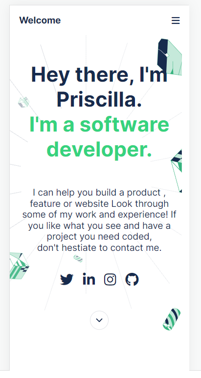
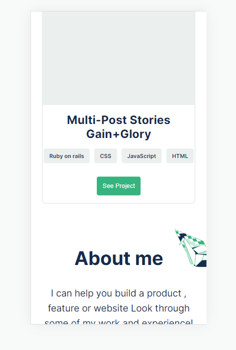
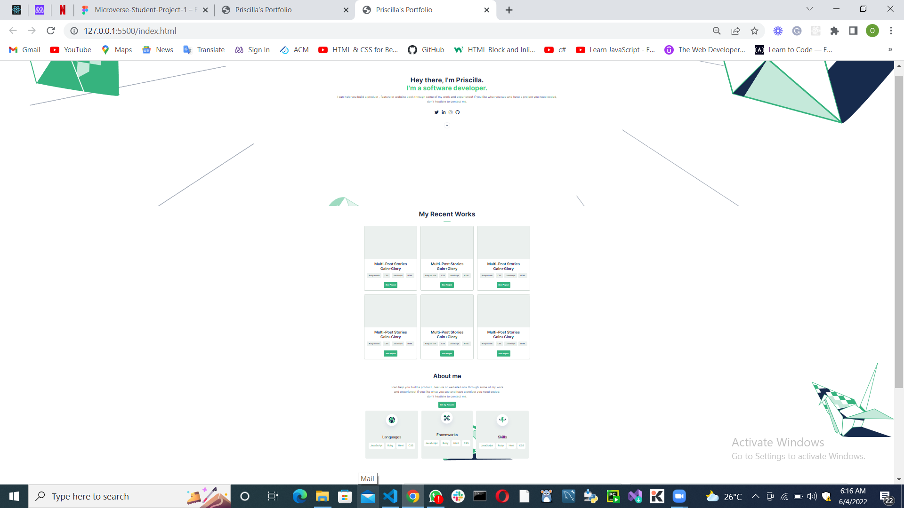

# Project Name: Portfolio Setup

> Portfolio setup:
> This project is about building my portfolio to showcase what I can do and my professional skills to intending employers(recruiters)
> The project is a responsive design for both mobile and desktop versions.
> The project is published on git pages on: https://prisca-tech.github.io/Portfolio/

## Built With

- html
- css
  -Figma

## Author Okoro Priscilla Oyome

👤 **Author**

- GitHub: [@Prisca-tech](https://github.com/Prisca-tech)
- Twitter: [@preateamie](https://twitter.com/preateamie)
- LinkedIn: [PriscillaOkoro](https://www.linkedin.com/in/okoro-priscilla-oyome/)

## Live Demo (if available)

Click [here](https://prisca-tech.github.io/Portfolio/) for a link to my portfolio.

## 🤝 Contributing

Contributions, issues, and feature requests are welcome!

Feel free to check the [issues page](../../issues/).

## Show your support

Give a ⭐️ if you like this project!

## Acknowledgments

- Myself
- Alzubair

## 📝 License

This project is [MIT](./MIT.md) licensed.

